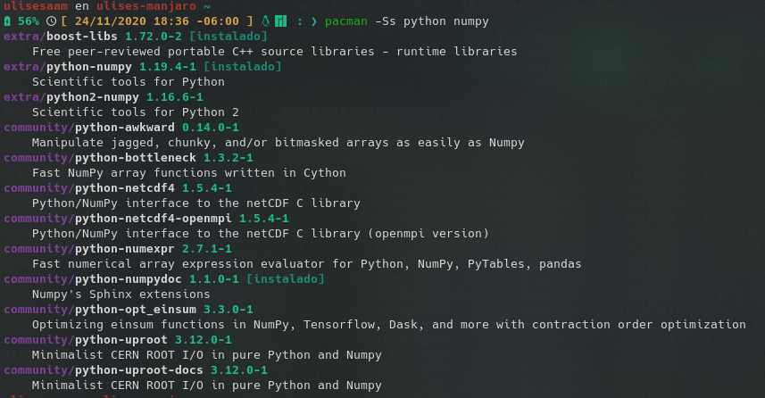
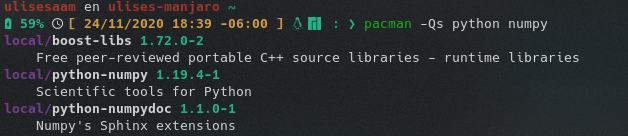
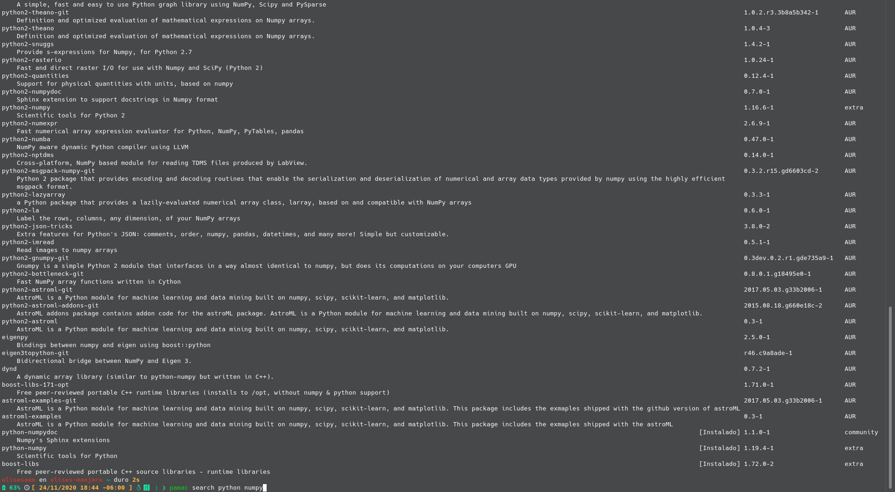
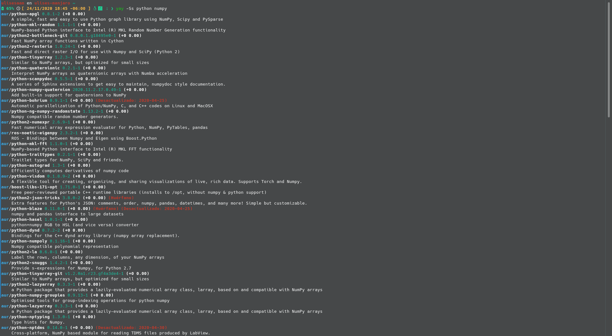
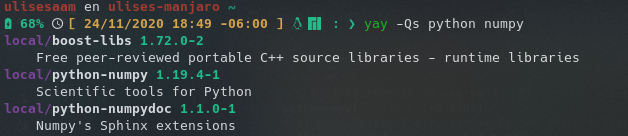
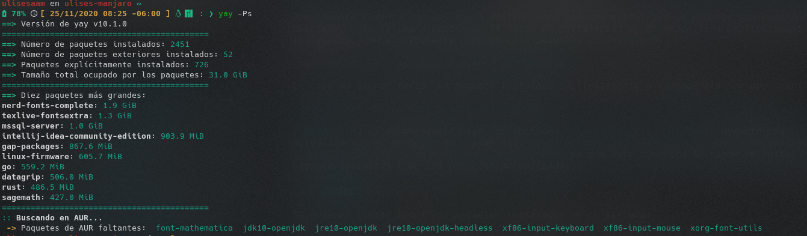
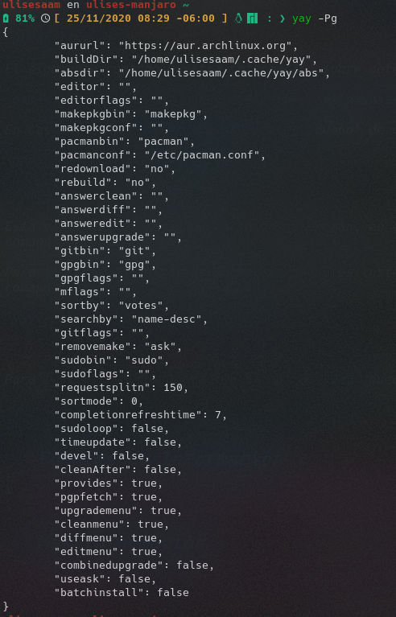

# Administración de software en distribuciones basadas en Arch:  Desde la consola
### Por: Ulises Alexander Argüelles Monjaraz
  
  
Hoy explicare como podemos administrar nuestros programas en Arch y distribuciones basadas en Arch, como Manjaro, el SO que uso, desde nuestra terminal o consola.
 
Empezando por los comandos en pacman, después pamac, comando desarrollado por y para Manjaro; terminando con yay, un ayudante para la AUR (Arch User Repository).

Los lectores que no sepan que es AUR, les comparto lo que la [wiki de Arch](https://wiki.archlinux.org/) nos dice sobre AUR[[1]](../Administracion-de-software-en-Arch.md#fuentes-de-información):

> Arch User Repository (AUR) es un repositorio promovido por los usuarios de la comunidad de Arch. Este contiene descripciones de los paquetes (PKG*BUILD) que le permiten compilar un paquete desde el código fuente con makepkg y luego instalarlo a través de pacman. 

## Búsqueda 

En caso de que los resultados sean demasiado y no se puedan ver por completo o no quieren que se queden ahi en su terminal pueden agregar `| less` al final de los siguientes comandos.

### pacman

Para buscar paquetes en los repositorios remotos con `pacman` se usa el siguiente comando:

`pacman -Ss [termino(s) de búsqueda]`

Aquí los paréntesis indicar que se debe sustituir por lo indicado entre paréntesis, por ejemplo:

`pacman -Ss python numpy`

En caso de realizar una búsqueda dentro del repositorio local, tus paquetes instalados, usa:

`pacman -Qs [termino(s) de búsqueda]`

Aquí los paréntesis indicar que se debe sustituir por lo indicado entre paréntesis, por ejemplo:

`pacman -Qs python numpy`

### pamac

Para `pamac` el comando para buscar paquetes tanto en los repositorios oficiales como en AUR es: 

`pamac search [termino(s) de búsqueda]`

Aquí los paréntesis indicar que se debe sustituir por lo indicado entre paréntesis, por ejemplo:

`pamac search python numpy`

### yay

Para buscar paquetes en los repositorios remotos y el AUR con `yay` se usa el siguiente comando:

`yay -Ss [termino(s) de búsqueda]`

Aquí los paréntesis indicar que se debe sustituir por lo indicado entre paréntesis, por ejemplo:

`yay -Ss python numpy`

En caso de realizar una búsqueda dentro del repositorio local, tus paquetes instalados, usa:

`yay -Qs [termino(s) de búsqueda]`

Aquí los paréntesis indicar que se debe sustituir por lo indicado entre paréntesis, por ejemplo:

`yay -Qs python numpy`

## Instalación 

A la hora de instalar un programa hay que prestar atención a los mensajes que nos muestra el programa, ya que puede indicarnos acciones que hay que hacer de manera manual.

### pacman

Para instalar un paquete o varios paquetes usando `pacman` el comando seria:

`sudo pacman -S nombre_del_paquete_1 nombre_del_paquete_2 ...`

Aunque esto es correcto, Manjaro[[2]](../Administracion-de-software-en-Arch.md#fuentes-de-información) y Arch[[3]](../Administracion-de-software-en-Arch.md#fuentes-de-información) recomienda usar el siguiente comando, ya que el anterior puede llevar a un estado de actualización parcial:

`sudo pacman -Syu nombre_del_paquete_1 nombre_del_paquete_2 ...`

Para instalar un paquete local que no esta en los repositorios, se puede hacer con:

`sudo pacman -U /ruta/del/paquete/nombre_del_paquete-version.pkg.tar.xz`

Si queremos que pacman conserve un copia del paquete en su cache, hay que hacer mediante:

`sudo pacman -U file:///ruta/del/paquete/nombre_del_paquete-version.pkg.tar.xz`

Adicionalmente pacman nos permite instalar un paquete remoto no presente en los repositorios oficiales:

`sudo pacman -U http://www.ejemplo.com/repo/ejemplo.pkg.tar.xz`

### pamac

Para instalar un paquete o varios paquetes usando `pamac` el comando seria:

`pamac install nombre_del_paquete_1 nombre_del_paquete_2 ...`

En caso de querer un paquete o varios paquetes del AUR el comando seria:

`pamac build nombre_del_paquete_1 nombre_del_paquete_2 ...`

A diferencia de pacman o yay que reinstalan el paquete si se pasa como argumento un paquete ya instalado, en pamac para forzar la reinstalación de uno o varios paquetes hay que usar:

`pamac reinstall nombre_del_paquete_1 nombre_del_paquete_2 ...`

### yay

Los comandos para `yay` son iguales a los de pacman pero sin sudo:

`yay -Syu nombre_del_paquete_1 nombre_del_paquete_2 ...`

`yay` nos proporciona una manera de instalar paquetes, dados terminos de busqueda nos presentara los paquetes que se nos listaria con `yay -Ss [termino(s) de búsqueda]` y nos pide seleccionar que paquetes deseamos instalar. El formato de la instrucción seria:

`yay [termino(s) de búsqueda]` 

## Desinstalación

### pacman

Para desinstalar un paquete o varios paquetes usando `pacman` el comando seria:

`sudo pacman -R nombre_del_paquete_1 nombre_del_paquete_2 ...`

Para desinstalar uno o varios paquetes y sus dependencia no usadas por otros programas, puedes usar:

`sudo pacman -Rs nombre_del_paquete_1 nombre_del_paquete_2 ...`

En caso de querer eliminar también los archivos de configuración, guardados por pacman, usa:

`sudo pacman -Rns nombre_del_paquete_1 nombre_del_paquete_2 ...`

### pamac

Para desinstalar uno o varios paquetes en `pamac` debes ingresar la siguiente orden:

`pamac remove nombre_del_paquete_1 nombre_del_paquete_2 ...`

### yay

Otra vez los comando son los mismos que `pacman` pero sin sudo.  
Para desinstalar un paquete o varios paquetes el comando seria:

`yay -R nombre_del_paquete_1 nombre_del_paquete_2 ...`

Para desinstalar uno o varios paquetes y sus dependencia no usadas por otros programas, puedes usar:

`yay -Rs nombre_del_paquete_1 nombre_del_paquete_2 ...`

En caso de querer eliminar también los archivos de configuración, guardados por pacman, usa:

`yay -Rns nombre_del_paquete_1 nombre_del_paquete_2 ...`

## Actualización

Independientemente del método usado para actualizar el sistema, es recomendable antes de proceder a usar los comando presentados, revisar los anuncios en el foro de Manjaro y de Arch, ademas de las noticias en la pagina de Arch, o de las distribución. Esto debido a que puede que el usuario necesite intervenir manualmente, o haya problemas específicos para determinado hardware, para lo cual sea mejor esperar a la solución para proceder con la actualización.

También, es recomendable prestar atención a los mensajes que nos muestra el gestor de paquetes.

### pacman

Para actualizar el sistema, todos los paquetes que tengan una actualización disponible, hay que escribir lo siguiente:

`sudo pacman -Syu`

En caso de haber cambiado de rama, o cambiaste los servidores espejo o mirrors de los repositorios, este es el caso por defecto en Manjaro ya que tiene activado un servicio cronometrado para actualizar los mirrors, así que si no has cambiado ese comportamiento usa el siguiente comando:

`sudo pacman -Syyu`

### pamac

Para verificar si hay actualizaciones disponibles usa el siguiente comando:

`pamac checkupdates -a`

Para actualizar los paquetes instalados escribe los siguiente en la terminal:

`pamac upgrade -a` 

### yay

Para actualizar el sistema, todos los paquetes que tengan una actualización disponible, hay que escribir lo siguiente:

`yay -Syu`

En caso de haber cambiado de rama, o cambiaste los servidores espejo o mirrors de los repositorios, este es el caso por defecto en Manjaro ya que tiene activado un servicio cronometrado para actualizar los mirrors, así que si no has cambiado ese comportamiento usa el siguiente comando:

`yay -Syyu`

## Huérfanos (Paquetes ya no necesarios como dependencias)

Los paquetes huérfanos son aquellos paquetes que se instalaron como dependencia de otro programa pero debido a la desinstalación del paquete que dependía de ellos han quedado huérfanos.

Recomiendo como buena practica para tratar con paquetes huérfanos, primero listarlos, después ver que función proporcionan, en caso de ser de utilidad para el usuario conservarlos, mas adelante proporcionare un comando para que ya no se considere huérfano, y después proceder a la eliminación de los que no son útiles, ya sea con el comando presentado a continuación o manualmente.

### pacman

Lista los paquetes huérfanos:

`pacman -Qdt`

Elimina los paquetes huérfanos, *usar con precaución*:

`sudo pacman -Rs $(pacman -Qdtq)`

### pamac

Para listar los paquetes huérfanos usa:

`pamac list -o`

Para eliminar los paquetes huérfanos el comando es:

`pamac list -o`

### yay

Lista los paquetes huérfanos:

`yay -Qdt`

Elimina los paquetes huérfanos, *usar con precaución*:

`yay -Rs $(yay -Qdtq)`

## Cache

### pacman

Para limpiar por completo la cache de paquetes instalados y no instalados salvo los últimos 3 paquetes usa:

`sudo paccache -r`

Para decider el numero de versiones a conservar usa:

`sudo paccache -rk[numero de versiones a conservar]`

Aquí los paréntesis indicar que se debe sustituir por lo indicado entre paréntesis, por ejemplo:

`sudo paccache -rk2`

### pamac

Para limpiar por completo la cache usa:

`pamac clean`

En caso de querer conservar algunos paquetes viejos como respaldo:

`pamac clean --keep [numero de versiones antiguas a conservar]`

Aquí los paréntesis indicar que se debe sustituir por lo indicado entre paréntesis, por ejemplo:

`pamac clean --keep 2`

## Otros

### pacman

El siguiente comando muestra información sobre determinado(s) paquete(s) en los repositorios oficiales, remotos:

`pacman -Si nombre_del_paquete_1 nombre_del paquete_2 ...`

El siguiente comando muestra información sobre determinado(s) paquete(s) instalado en el sistema:

`pacman -Qi nombre_del_paquete_1 nombre_del paquete_2 ...`

Si se quiere listar los archivos que pertenecen a cierto paquete:

`pacman -Ql nombre_del_paquete`

Si se quiere listar los archivos que pertenecen a cierto paquete remoto:

`pacman -Ql nombre_del_paquete`

En caso de querer saber que paquete es "dueño" de un archivo pueden usar el siguiente comando:

`pacman -Qo /ruta/del/archivo`

En caso de querer saber paquete remoto es "dueño" de un archivo pueden usar el siguiente comando:

`pacman -F /ruta/del/archivo`

Existe una utilidad conocida como `pactree` que nos permite ver el árbol de dependencias, para usarlo hay que escribir:

`pactree nombre_del_paquete`

Con esa utilidad tambien es posible ver el árbol de dependientes hay que agregar la opcion `-r`:

`pactree -r nombre_del_paquete`

Previamente comente que les iba a mostrar como podemos evitar que un paquete sea considerado huérfano, esto se logra cambiando la razón de instalación de dependencia a explicitamente instalaldo, con el siguiente comando para paquetes ya instalados:

`sudo pacman -D --asexplicit nombre_del_paquete`

En caso de querer forzar un paquete instalado explicitamente a dependencia hay que usar:

`sudo pacman -D --asdeps nombre_del_paquete`

**Nota:** no es recomendable usar las opciones `--asexplicit`, `--asdeps` durante una actualización es decir, **no** usar asi: `sudo pacman -Syu --asexplicit nombre_del_paquete` o 
 `sudo pacman -Syu --asdeps nombre_del_paquete` ya que esto cambiara la razon de instalacion del paquete instalado y de los paquetes actualizados.
 
### pamac

Si quieres listar todos los paquetes instalados en tu sistema:

`pamac list -i`

El siguiente comando muestra información sobre determinado(s) paquete(s):

`pamac info nombre_del_paquete_1 nombre_del_paquete_2 ...`

En caso de querer saber que paquete es "dueño" de un archivo pueden usar el siguiente comando:

`pamac search -f /ruta/del/archivo`

### yay

Esta vez como los comandos parecidos a pacman, en esta categoria, son muchos, solo presentare los comandos propios de yay.

Para imprimir estadisticas sobre los paquetes instalados en tu sistema pueden usar el siguiente comando:

`yay -Ps`

Para imprimir la configuracion actual de `yay` puedes usar:

`yay -Pg`

## Fuentes de Información
* [[1]](https://wiki.archlinux.org/index.php/Arch_User_Repository_\(Espa%C3%B1ol\))
* [[2]](https://wiki.manjaro.org/index.php/Pacman_Overview#Installing_Packages)
* [[3]](https://wiki.archlinux.org/index.php/Pacman#Installing_packages)

## Mas información
* [Entrada en la wiki de Manjaro dedicada a pamac (Ingles)](https://wiki.manjaro.org/index.php/Pamac)
* [Entrada en la wiki de Manjaro dedicada a pacman (Ingles)](https://wiki.manjaro.org/index.php/Pacman_Overview)
* [Entrada en la wiki de Arch dedicada a pacman (Ingles)](https://wiki.archlinux.org/index.php/Pacman)
* [Pagina de GitHub del proyecto yay (Ingles)](https://github.com/Jguer/yay)
* [Entrada en la wiki de Arch dedicada a pacman (Español)](https://wiki.archlinux.org/index.php/Pacman_(Espa%C3%B1ol))
